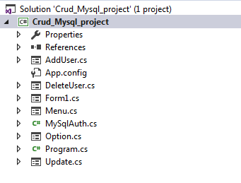
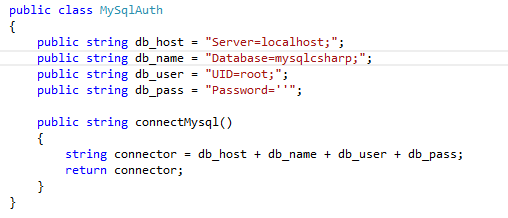
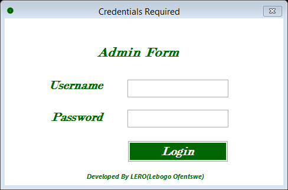
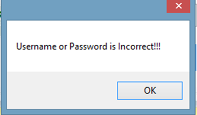
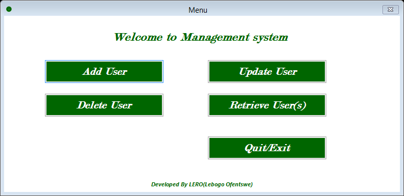
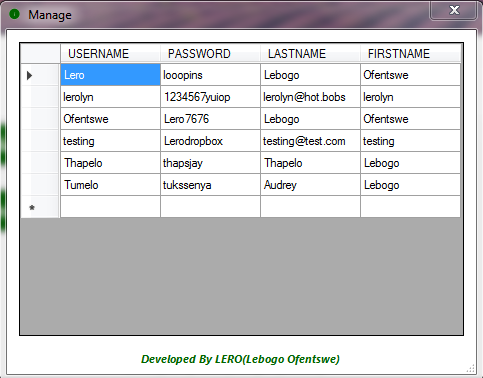
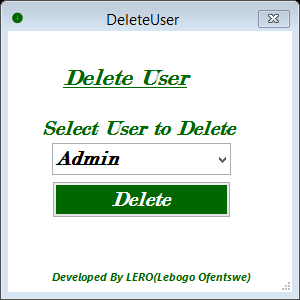
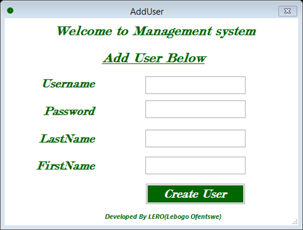
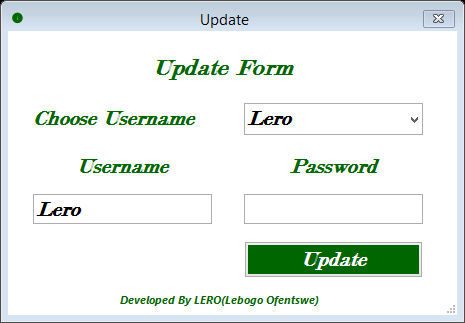

# Author : LEBOGO OFENTSWE RAMOSHAU
**This project is Developed on C# Forms it covers the CRUD**  
**CRUD - Create, Retrieve(Read), Update and Delete users of the system**  
**The application is free an open for everyone and can be referenced**  

## The project was developed for practice purpose and can be improved if any suggest an update on it

## Dependencies 
* Install the following  
** Visual Studio C# 2013 / 2015 **  
** MySQL (XAMPP Recommended) **  
** MySQL connector .Net **  

### If above software are intalled import mysqlcsharp.sql from data directory into XAMPP on phpMyAdmin
#### The File Structure is as Follows

## Common Errors or Warning 
### You might get error concerning mysql this will be solved by right cliking on the project and click add reference and choose/tick mysql extension and it will be solved, make sure you installed packages successfully and properly 

## Change The following Lines Below for your own use in file Named  *MySqlAuth.cs*  
  

** Make sure that XAMPP is running (MySQL and Apache) **  

## Run the C# program by pressing the green button 

### The First Screen that will appear should be this     
   
** Enter one of the username and corresponding password from the database **   
** The password is wrong , you will recieve this error message **   
    

** If you are successfully loggedin you should have this screen **  

** For example if Retrieve button is pressed, you must be able to see the following form ** 
 

** If Delete button is pressed, you must be able to see the following form ** 

** If Add User button is pressed, you must be able to see the below form , and you will be able to add user** 
  

** If Update button is pressed, you must be able to see the below form , and you will be able to select a specific user and  Update password ** 
 

:+1: :octocat:    

### Cheers
